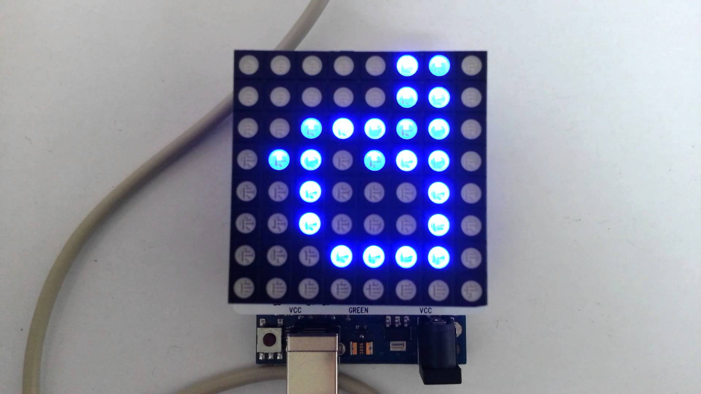
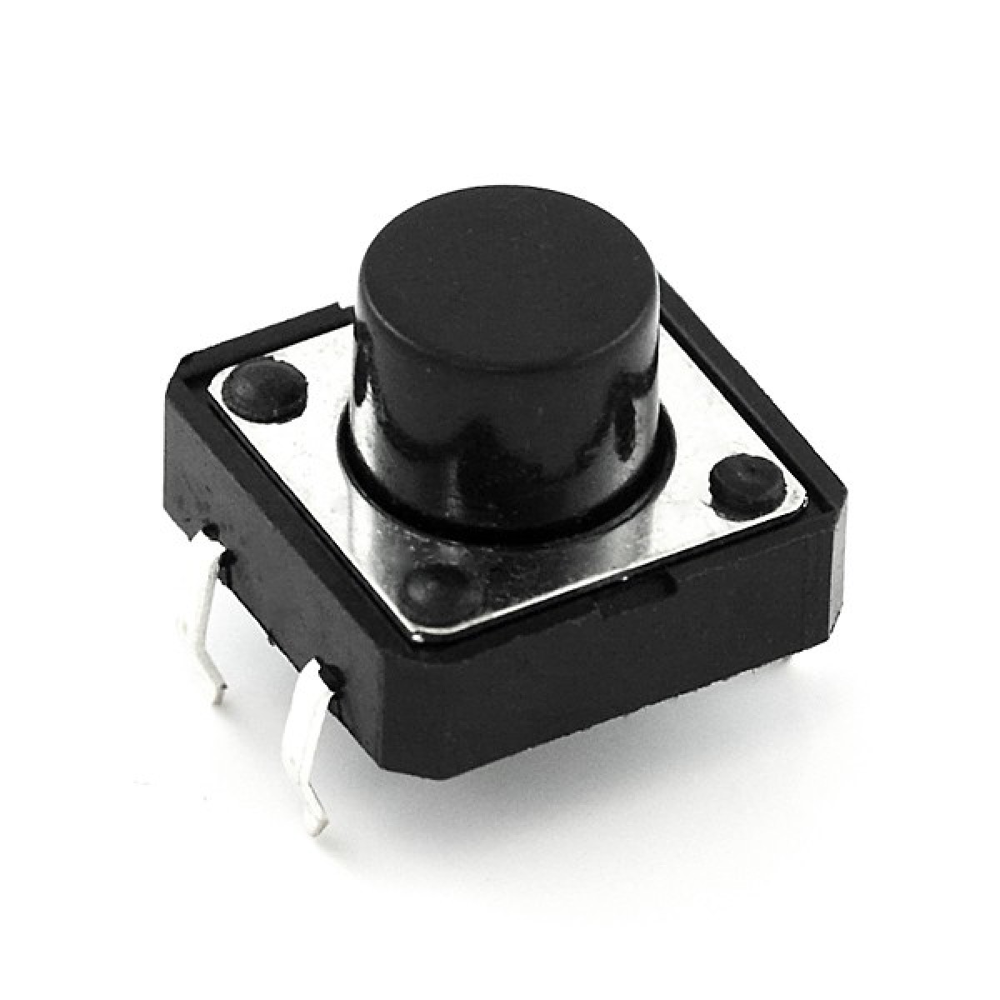

##머리말
이 문서는 현재 주목받고 있는 IT기술인 IoT(사물 인터넷, Internet of Things)을 누구나 쉽게 접해볼 수 있게 해준 아두이노라는 오픈소스 마이크로 컨트롤러 보드를 누구나 쉽게 다룰 수 있게끔 작성되었습니다. 공학이나 프로그래밍을 전혀 접해보지 않았거나, 프로그래밍을 접해봤어도 아두이노 같은 마이크로 컨트롤러 보드를 한번도 다뤄보지 않은 초보자 분들이 부담없이 읽고 아두이노를 배워가시기에 적합합니다. 열정만 있으면, 여러분도 아두이노를 통해 실생활에서 쓰일 여러가지 물건들을 만드실 수 있을겁니다.

아두이노(Arduino)는 이탈리아어로 '강력한 친구' 라는 뜻입니다. 임베디드 프로그래밍이나 공학 등의 경험이 전혀 없는 사람들을 위해 제작된 교육용 플랫폼이기 때문에 누구나 부담없이 아두이노 코드를 작성하고, 쉽게 업로드하고 작동시킬 수 있게 설계되어 있습니다.

###이 책은..

이 책은 프로그래밍을 처음 접한 초보자 혹은 기초적 프로그래밍 지식은 가지고 있으나, 아두이노를 한번도 다뤄보지 않은 초보자 대상으로 진행됩니다. 최대한 전문적인 어려운 내용은 배제하고, 아두이노에 흥미를 들이는 것 그 자체에 의미를 두고 문서를 작성되었습니다.

이 책의 목표는 Learning By Doing 이라는 교육 방식을 적용하여, 책을 읽고 있는 여러분으로 하여금 지루한 이론교육 보다는 여러 예제들을 수행하면서, 아두이노와 IoT 기술에 대한 흥미를 가지게끔 하는 것입니다.

***코드베이커리 창업동아리 일동***

~~~
본문 작성 : 조동현, 박재성

아두이노 소스코드 및 회로 작성 : 이한결, 라윤이

사진촬영 : 이한결, 라윤이
~~~

##목차

***목차.md 파일 참고***

##아두이노

###아두이노가 뭘까?

아두이노는 이탈리아어로 강력한 친구라는 뜻을 가지고 있으며, 전자공학이나 로봇공학, 임베디드 프로그래밍 같은 전문적인 기술을 배우지 않은 사람들도 원하는 도구를 만들 수 있도록 설계된 오픈소스 마이크로 컨트롤러 보드입니다. 아두이노 프로그래밍과 여러 센서, 모터등의 사용법에 익숙해 지시기만 한다면, 생활속에서 필요한것들을 여러분이 직접 만들어서 사용하는 재미를 느끼실 수 있을 것입니다. 예를 들어 정해진 시간에 물고기에게 밥을 주는 기계를 만들수도 있고, 한밤중 침입자를 대비한 방범장치도 모두 여러분이 DIY(Do It Yourself) 하실 수 있습니다.

###아두이노의 종류

~~~
이해하기 어려울 것 같은 내용이 다수 포함되어 있는데, 중요한 부분만 넣을지,

아니면 그래도 전부 집어넣을지 고민해봐야할 듯 함
~~~

아두이노는 회로도가 공개된 **오픈소스** 마이크로 컨트롤러 보드라 아두이노 재단에서 공식으로 판매되는 제품 이외로 사용용도에 알맞게 커스터 마이징된 제품들이 많이 제작되고 판매되고 있습니다. 웨어러블 관련 기기를 제작하기 쉽게 만들어진 커스텀 보드도 있고, 공식 보드와 구조는 같지만, 조금 더 저렴한 제품을 채택하여, 값싸게 보급된 커스텀 보드도 있습니다. 여기서는 보편적으로 많이 사용되는 보드 몇 가지를 설명합니다.

####아두이노 Uno
아두이노 UNO보드는 현재 가장 보편적인 보드로 대부분의 쉴드가 UNO보드와 호환이 되며 USB 통신을 위한 FTDI 칩을 기본으로 내장하고 있어(ATmega16U2) 별도의 변환기 없이 PC등에 바로 USB로 연결해서 사용할 수 있습니다. 5V, 3.3V 모두 지원하며 USB 전원을 사용 할 수 있어 외부 입력 전원도 지원합니다. 예제와 강좌 및 라이브러리가 UNO 기반으로 된 것들이 많아 처음에 **입문용으로 사용하기에 좋습니다.**

요약하자면, 많은 부품들을 대부분 사용할 수 있고, 쉽게 PC와 연결이 가능하고, 인터넷에 올라와있는 정보들의 대부분이 UNO 기준으로 작성되어 있기 때문에 초보자분들이 사용하기 편한 보드입니다.

####아두이노 Nano
ATmega16U2 칩을 사용하므로 UNO와 동일한 기능을 그대로 제공합니다. 직접 USB로 업로드가 가능하고 5V, 3.3V 전원 핀을 갖추고 있어 외부 센서의 전압을 맞추기가 훨씬 더 간편합니다.

아두이노 Uno 와 다르게 핀이 튀어나와 있어서 튀어나온 전선 (M형 점퍼선) 을 사용하지 않고, 안쪽으로 들어간 전선 (F형 전선) 을 사용할 수 없습니다. 하지만, 이런 특징으로 인해 브레드 보드에 직접 꽃아서 작업할 수 있는 장점이 있습니다. 하지만 아두이노 Uno 에서 사용하는 케이블을 사용할 수 없고, mini-B 타입 USB를 사용해야 합니다.

####아두이노 Leonardo
아두이노 Leonardo는 UNO보드와 흡사하게 생겼지만 약간의 차이점을 갖고 있는 보드입니다. 아두이노 Leonardo는 ATmega32u4 칩을 탑재하고 있습니다. ATmega32u4 칩은 내부에 USB통신을 위한 기능을 갖추고 있기 때문에 아두이노 UNO보드처럼 별도의 변환기를 필요로 하지 않습니다. UNO보드 보다 핀의 수가 많고 특수한 기능(PWM, 12C, SPI 등)을 담당하는 핀이 아두이노 UNO와는 완전히 다르기 때문에 충분히 매뉴얼을 습득하고 사용하셔야 합니다.

####아두이노 PRO
UNO처럼 ATmega328 칩을 사용하므로 **UNO와 동일한 기능을 제공**합니다. 다만 USB통신, 동작전압과 전원 관련된 부분들이 UNO보드와는 큰 차이를 보입니다. Pro 보드의 경우 파워버튼과 외부 배터리용 커넥터가 내장되어 있지만 사이즈가 좀 큽니다. Pro mini는 이마저도 없지만 대신 33x18mm 로 초소형입니다. 작은 사이즈를 위해 칩형 부품을 사용했으며 가격 절감을 위해 USB 통신기능 (FTDI 칩)마저 빼버렸습니다. 따라서 PC에 연결 및 소스 업로드를 위해서는 **USB to Serial (or USB to UART or FTDI) 변환기가 별도로 필요**합니다.

####아두이노 Mega2560
기존의 아두이노 Mega를 대체하는 보드로 고성능과 많은 IO핀을 제공하는 것이 특징입니다. 로봇이나 이미지, 음성, 영상 등 대체적으로 고성능을 요구하는 곳에 사용될 수 있습니다. 다만 표준 아두이노 UNO보드와 핀 배열, 특징이 완전히 틀리기 때문에 아두이노를 처음 만지는 경우 어려울 수 있습니다.

###관련 부품

아두이노가 준비되어 있어도 아두이노 만으로는 할 수 있는 것이 별로 없습니다. 불빛 하나만 띄우려고 해도 LED라는 부품이 필요하죠. 어려운 부품들은 추후에 직접 사용하는 단계에서 깊게 설명할 예정이며, 이곳에서는 간단히 자주 등장하는 부품의 설명을 간략하게 적어놓도록 하겠습니다.

**LED** LED는 Light Emitting Diode의 줄임말로써 한국어로는 **발광 다이오드**라고 합니다. LED는 많은 분들이 알고 계시겠지만, 전류를 흘려보내면 빛을 내는 특성이 있습니다. 기본적으로 **다이오드**이기 때문에 일방통행처럼 전류가 한쪽 방향으로만 흘러갑니다. 전기에너지를 빛 에너지로 특히 가시광선 영역으로 거의 100% 변환할 수 있는 고효율 발광체입니다. 

**점퍼선** 점퍼선은 쉽게 말하면 전류가 흐를수 있도록 길을 내주는 흔히 말하는 **전선** 입니다. 

**저항** 저항은 전기의 흐름을 방해하여, 전류의 양을 조절 할 수 있는 부품입니다. 수도꼭지를 조절하여 나오는 물의 양을 조절하듯이 전류가 흐르는 길에 저항을 설치하면, 흐르는 전류의 양이 줄어들게 되어 원하는 전류의 양만 흐르게 할 수 있습니다.

**조도센서** 조도센서는 주변의 빛을 감지할 수 있는 센서입니다. 자세한 내용은 ***초보발명가-밝기를 감지하자*** 에서 다룹니다.

**피에조버저** 피에조 버저는 전류가 흐르면 소리를 내는 일종의 스피커같은 부품입니다. 여러 소리 신호를 발생시킬 때 주로 사용되는 부품입니다. 자세한 내용은 ***초보발명가-소리 내보기*** 에서 다룹니다.

**DC모터** DC모터는 전류를 흘려 보내면 자동차 바퀴처럼 한방향으로 계속 돌게 되는 모터입니다. 앞서 말했듯이 바퀴같은 것들을 만들 때 주로 사용되는 부품입니다.

**서보모터** 서보모터는 한방향으로만 계속 돌게되는 DC모터와 다르게, 움직이는 방향과 어느 각도로 움직일지를 설정하여 움직임을 제어할 수 있는 모터입니다. 주로 로봇 팔이나 정밀한 움직임이 요구되는 곳에서 사용됩니다.

**컬러 매트릭스** 컬러 매트릭스는 길거리에서 흔히 보이는 전광판의 축소판이라고 생각하면 됩니다. 여러 LED가 정사각형으로 모여있고, 원하는 모양을 띄울 수 있습니다. 여러 크기의 제품들이 존재하지만, 본 교재에서는 8x8 짜리 컬러 매트릭스를 사용합니다.

**버튼** 버튼은 말그대로 누르면 전류가 흐르게 되는 부품입니다. 

**세븐 세그먼트** 세븐 세그먼트는 엘리베이터에서 층수를 나타내주는 불빛이라고 생각하시면 됩니다. 빛을 낼 수 있는 부분이 7개로 나뉘어 져 있어 **세븐 세그먼트** 라는 이름을 갖게 되었습니다. 0부터 9까지의 숫자를 나타낼때 주로 사용됩니다. 

**온습도 센서** 온습도 센서는 센서 주변의 온도와 습도를 체크할 수 있는 센서입니다. 주로 주변 날씨를 체크할 때 사용됩니다.

**토양 습도 센서** 토양 습도 센서는 토양의 습기를 체크할 수 있는 센서입니다. 화분에 물을 깜빡하고 주지 않았을 때, 흙이 말랐으면 화분 주인에게 알려줄 수 있는 프로젝트를 할때 사용하게 됩니다.

**캐릭터 LCD** 캐릭터 LCD는 글자를 나타낼 수 있는 LCD 입니다. 보통 16x2 (한줄에 16글자, 2줄짜리)크기를 이용합니다. 

**브레드 보드** 브레드 보드가 없으면, 우리는 회로를 구성할 때 전선과 전선을 잇기위해 납땜을 해야하고, 센서나 여러 부품들을 연결할 때도 납땜을 해야합니다. 하지만, 브레드 보드는 그런 불편함을 없애기 위해 전선을 그저 꽃기만 하면, 회로를 구성할 수 있습니다.

**초음파 센서** 초음파 센서는 초음파를 발사해 바로 앞에 있는 물체와 센서사이의 거리를 측정할 수 있는 센서입니다. 보통 로봇등을 만들 때 사용됩니다.

-

##발명 도구 준비

###아두이노 선택과 구매

아두이노 파트에서 언급했듯이 아두이노의 종류는 대중들이 커스터 마이징 한 버전까지 포함하여 셀수 없을 정도로 많습니다. 대부분이 특정 용도에 맞춰서 제작되었는데, 이 수많은 아두이노 중 **아두이노 UNO**는 아두이노의 **표준**으로서 초보자, 입문자 대상으로 가격도 저렴하기 때문에 많이 소비되고 있는 모델입니다. 이 책의 대상은 초심자 혹은 입문자이므로 아두이노 UNO를 사용하여 진행합니다. 

###아두이노 IDE

아두이노 프로그래밍 하려면 작동하는 소스코드를 작성하고, 아두이노에 해당 소스코드를 업로드할 프로그램이 있어야합니다. 우리는 아두이노 재단에서 만든 공식 IDE (통합 개발 환경) 인 **아두이노 IDE**를 사용합니다.

https://www.arduino.cc/en/Main/Software

해당 사이트에 접속하여, 자신의 운영체제 환경에 맞는 아두이노 IDE 설치 프로그램을 다운받고, 설치해줍니다. 아두이노 IDE가 여러분의 컴퓨터에 설치가 되었다면, 실행시켜 줍시다.

아두이노 IDE 는 이렇게 생겼습니다. 이 아두이노 IDE에 여러분의 소스코드를 입력하고, 아두이노를 연결하여 소스코드를 업로드하여 아두이노를 작동 시킬 수 있습니다.

그리고 몇가지 세팅을 해줘야 합니다. 첫번째로 포트 설정을 해줘야 합니다. 여러분들의 컴퓨터에는 많은 USB포트가 존재합니다. 우리는 이 많은 USB 포트중에서 아두이노와 통신할 포트를 설정해줘야 합니다.

(포트 설정 설명, 윈도우/맥)

두번째로 아두이노 보드 설정을 해줘야 합니다. 무슨 보드로 작업을 할 것인지 선택해야 합니다. 우리는 아두이노 Uno 를 사용하기 때문에 아두이노 IDE에서 보드를 아두이노 Uno 로 설정해줍니다.

(보드 설정 설명, 윈도우/맥)

##초보 발명가

###LED 켜보기
첫번째 프로젝트로 부품설명에서 언급된 LED를 직접 켜보도록 해보겠습니다. LED를 켜기 위해서는 다음과 같은 준비물이 필요합니다.

	시리얼 통신 케이블, 우노 보드, 브레드보드, LED, 점퍼선
	
아두이노 보드를 케이블을 이용하여 PC와 연결해줍니다. 그 다음 점퍼선과 LED을 이용해 다음 사진과 회로도를 참고하여 회로를 구성해줍니다.

그리고 다음 소스코드를 업로드 해줍니다.

~~~js
void setup() {
	pinmode(13, OUTPUT);
}

void loop() {
	digitalWrite(13, HIGH);
}
~~~

void setup() {

} 

안에 들어가는 코드는 아두이노가 켜졌을 때 실행되는 코드입니다.

void loop() {

}

안에 들어가는 코드는 아두이노가 켜진 이후 반복적으로 실행되는 코드입니다.

지금 당장 이해되지 않으셔도 상관없습니다. 본 교재와 함께 여러 프로젝트를 진행하다 보시면, 자연스럽게 이 부분이 어떤 부분인지 이해하시게 될 것입니다.

* **pinmode(13, OUTPUT);** 은 LED를 꽃은 13번 핀에서 전력이 나오도록 설정해주는 부분입니다. OUTPUT으로 설정하면 전류의 방향이 아두이노에서 LED쪽으로 설정됩니다. 반대로 INPUT으로 설정해주면, 13번핀에 꽃은 여러 모듈이나 센서로부터 전기신호를 아두이노 내부로 보내주는 것으로 설정됩니다.

* **digitalWrite(13, HIGH);** 는 13번 핀으로 전류를 흘려보내라는 뜻입니다. 전기신호는 0과 1로 구성되어 있습니다. 0은 전류가 흐르지 않음을 의미하고, 1은 전류가 흐름을 의미합니다. 이것을 아두이노에서는 LOW와 HIGH로 나타냅니다. LOW는 전류가 흐르지 않게 하고, HIGH는 전류를 흐르게 만듭니다.

우리는 pinmode 함수를 setup 함수에 넣어줘, 핀모드를 아두이노가 작동되자 마자 설정되게 하고, digitalWrite 함수를 loop 함수에 넣어줘, 항상 13번 핀에 전류를 흐르게 설정한 것입니다.

자, 여러분은 처음으로 아두이노를 이용하여 LED를 켜보았습니다. 축하드립니다.

###신호등 만들기

방금 배운 LED제어 기술을 응용하여, 간단한 신호등을 만들어 봅시다. 준비물은 다음과 같습니다. 

	시리얼 통신 케이블, 우노 보드, 브레드보드, 3가지 색상의 LED, 점퍼선
	
회로를 다음 회로도와 같이 구성해줍니다.

그리고 아래 소스코드를 아두이노에 업로드 해줍니다.
	
~~~js
int carRed = 12;

int carYellow = 11;

int carGreen = 10;

void setup() {

  pinMode(carRed, OUTPUT);

  pinMode(carYellow, OUTPUT);

  pinMode(carGreen, OUTPUT);

  digitalWrite(carGreen, HIGH);

}

void loop() {
  
  digitalWrite(carGreen, LOW);
  delay(500);
  
  digitalWrite(carYellow, HIGH);
  delay(500);
  
  digitalWrite(carYellow, LOW);
  delay(500);
  
  digitalWrite(carRed, HIGH);
  delay(500);
  
  digitalWrite(carRed, LOW);
  delay(500);
  
  digitalWrite(carYellow, HIGH);
  delay(500);
  
  digitalWrite(carYellow, LOW);
  delay(500);
  
  digitalWrite(carGreen, HIGH);
  delay(500);
  
}
~~~

carRed, carYellow, carGreen 이라는 변수에 각각 12, 11, 10 이라는 값을 넣어줍니다. 변수라는 것은 데이터를 담는 그릇입니다. 

int carRed = 12; 라는 명령을 실행해줌으로써 carRed 라는 것은 12를 나타내게 됩니다. 이것을 '변수를 선언한다' 라고 합니다.

pinMode(carRed, OUTPUT); 라는 명령을 실행 하게 되면 carRed라는 변수에 12라는 값이 저장되어 있기 때문에 12번 핀을 OUTPUT으로 설정됩니다.

그런데 loop 함수에서 delay 라는 함수가 보입니다. delay 함수는 다음 명령을 실행하기 전에 넣어준 숫자만큼 쉽니다. delay 함수에 넣어주는 숫자의 단위는 ms (밀리세컨드) 라서 1000은 1초를 의미합니다. 그러므로 500은 0.5초를 의미합니다.

따라서 **delay(500);** 명령이 실행될 때마다 0.5초동안 아무 명령도 실행하지 않습니다.

결과적으로 소스코드를 직접 업로드하게 되면, 연결한 3개의 색상 LED가 노랑색, 빨강색, 노랑색, 초록색 순서대로 켜지는 모습을 볼 수 있습니다.

###크리스마스 트리 만들기

방금 배운 순서대로 각 색상 LED 를 껐다 켜는 기술을 응용하여, 랜덤으로 깜빡거리는 크리스마스 트리를 제작해보도록 하겠습니다.

~~~java

int whiteLED = 13;
int blueLED = 12;
int yellowLED = 11;
int greenLED = 10;
int redLED = 9;

// 5개의 LED를 연결하고 랜덤하게 한 개 씩 깜빡이도록 하는 예제

void setup() {
  pinMode(whiteLED,OUTPUT);
  pinMode(blueLED,OUTPUT);
  pinMode(yellowLED,OUTPUT);
  pinMode(greenLED,OUTPUT);
  pinMode(redLED,OUTPUT);
  
  digitalWrite(whiteLED,LOW);
  digitalWrite(blueLED,LOW);
  digitalWrite(yellowLED,LOW);
  digitalWrite(greenLED,LOW);
  digitalWrite(redLED,LOW);
}

void loop() {
  int randNumber = random(9,14);
  digitalWrite(randNumber,HIGH);
  delay(250);
  digitalWrite(randNumber,LOW);
  delay(250);
}
~~~

하얀색, 파란색, 노란색, 초록색, 빨간색 LED가 꽃혀있는 핀 번호를 설정해줍니다. setup 함수에서는 pinMode를 설정해주고, 혹시 켜져있을 LED를 대비하여, digitalWrite 로 해당 핀을 LOW 로 설정해줍니다. 

그런데, loop 함수에서 처음보는 무언가가 보입니다.

~~~java
int randNumber = random(9,14);
~~~

random 함수가 새로 등장합니다. random 함수는 넣어준 숫자 사이중 하나를 무작위로 골라주는 함수입니다. 우리는 random(9,14) 라는 명령을 통해 random 함수에 9와 14라는 숫자를 넣어줬습니다. 이는 random 함수에게 9에서 14까지의 숫자중에서 아무 숫자나 반환하라는 의미입니다. 예를들어 11같은 숫자가 반환됩니다. 반환된 숫자는 randNumber 라는 변수에 저장됩니다.

~~~java
digitalWrite(randNumber,HIGH);
delay(250);
digitalWrite(randNumber,LOW);
delay(250);
~~~

그 이후, 이 명령을 통해서 랜덤으로 생성된 핀 번호에 HIGH 신호를 주었다가, 0.25초 뒤에 LOW 신호를 주게 되어 결과적으로 무작위의 LED가 켰다 꺼지게 됩니다.
	

###부드럽게 깜빡이는 LED

딱딱하게 켜졌다 꺼지기만 하는 LED에 슬슬 질려가는 듯 합니다. 조금 주제를 바꿔서 부드럽게 켜졌다 꺼지는 LED를 만들어 보도록 합시다.

~~~java
int led = 9;
int brightness = 0; // LED의 밝기 값
int fadeAmount = 5; // LED의 밝기 변화 간격

void setup() {
  pinMode(led, OUTPUT);
}

void loop() {
  analogWrite(led, brightness); // LED의 밝기 결정
  brightness = brightness + fadeAmount; // analogWrite를 사용해서 brightness의 값은 0~255
  if (brightness == 0 || brightness == 255) { // '||' 은 'or'와 같은 의미이다.
    fadeAmount = -fadeAmount ;
  }
  delay(30);
}

~~~

이번 예제는 아두이노의 PWM 기능을 사용하기 때문에 led를 PWM기능이 있는 핀에 연결해야합니다. 
PWM 기능을 가진 핀은 앞에 '~'마크가 붙어 있습니다. (우노 기준 D3, D5, D6, D9, D10, D11) 아래 사진을 참고해주세요.

***사진 첨부 필요할듯***

위에서 선언한 brightness 와 fadeAmount 변수는 각각 LED의 밝기 값과 LED의 밝기 변화 간격을 의미합니다. 현재 fadeAmount가 5로 설정되어 있으니 밝기값은 5씩 변화되겠네요. 

그런데, 처음보는 코드가 존재합니다.

~~~java
analogWrite(led, brightness);
~~~

우리는 digitalWrite 밖에 사용하지 않았는데, analogWrite라는 함수가 등장합니다. digitalWrite 는 HIGH 와 LOW 라는 켜짐과 꺼짐, 즉 1과 0의 정보밖에 핀에 전달 할 수 없었습니다. 하지만 analogWrite 함수를 이용하면 해당 핀에 켜짐과 꺼짐을 넘어서 전기신호의 세기를 0부터 255까지 표현할 수 있습니다. 

loop 함수가 반복적으로 실행되면서 brightness는 fadeAmount 만큼 증가합니다.

그런데 또 처음보는 명령문이 등장합니다.

~~~java
if (brightness == 0 || brightness == 255) { // '||' 은 'or'와 같은 의미이다.
  fadeAmount = -fadeAmount ;
}
~~~

if 문은 if 다음에 오는 **()** 안의 조건을 만족하면, **{}** 안의 소스코드를 실행합니다.

예를 들어

~~~java
int a = 5;
if (a == 5) {
  digitalWrite(13, HIGH);
}
~~~

이런 소스코드가 있다 치면, a라는 변수의 값은 5이니 digitalWrite 함수를 실행하게 됩니다.

~~~java
int a = 6;
if (a == 5) {
  digitalWrite(13, HIGH);
}
~~~

반대로 이런 경우가 있다면, a라는 변수의 값은 6이니 digitalWrite 함수는 실행되지 않습니다.

그런데, 위의 소스코드에는 || 라는 문자도 존재합니다. 이것은 'OR' 과 같은 의미를 지니는 문자입니다. 왼쪽의 조건과 오른쪽의 조건중 '하나만' 맞더라도 중괄호 안의 코드를 실행시킵니다. 결국 위의 소스코드는 

	brightness == 0 이거나 brightness == 255 일때 아래 소스코드를 실행시켜라
	
라는 의미가 됩니다. 그렇게 0에서 5를 계속 더하다가 brightness가 255 이 되면 fadeAmount 는 

~~~java
fadeAmount = -fadeAmount;
~~~

해당 명령을 통해 -5 가 됩니다. 그렇다면 brightness 가 255가 되면 fadeAmount 는 -5가 되고, brightness가 0이 될때까지 -5를 해주게 됩니다.

이런 원리를 통해 LED는 부드럽게 깜빡일 수 있는 것입니다.

 
###소리 내보기

###비행기 연주하기
위에서 배운 소리 내보기를 이용하여 간단한 멜로디를 연주해 봅시다. 단순히 소리를 내는것에서 벗어나서 내고 싶은 소리의 주파수를 지정해 주어야 합니다. 특정 음의 소리가 나는 원리를 잠깐 살펴보도록 하겠습니다. 소리 파동은 결국 공기의 진동이라고 말할 수 있습니다. 즉, 높은 주파수의 진동은 더 높은 음의 소리를 내게 됩니다. 한번 예를 들어보죠. ‘도’ 음의 주파수는 277Hz입니다. 우리는 이 ‘도’의 음을 내기 위해서 스피커 또는 버저를 연결할 것입니다. 우리가 277Hz의 음을 내고자 한다면, 아두이노는 디지털 출력을 277번 on/off 할 것입니다. 그리고 스피커 또는 버저는 이 전기적인 신호를 파동으로 바꾸게 됩니다. 
자, 그럼 간단한 멜로디를 연주할 수 있는 아두이노 코드를 살펴보도록 하겠습니다.
~~~Java
int piezo = 13;
// mid 도 = 261, 레 = 294, 미 = 330
int c = 261;
int d = 294;
int e = 330;

void setup() {
  pinMode(piezo,OUTPUT); // piezo 부저 연결 핀
}

// '비행기'라는 동요를 piezo 부저를 이용해 출력하는 예제이다.
// 미 레 도 레 미 미 미 레 레 레 미 미 미 미 레 도 레 미 미 미 레 레 미 레 도

void loop() {
  tone(piezo, e, 750);
  tone(piezo, d, 500);
  tone(piezo, c, 500);
  tone(piezo, d, 500);
  
  tone(piezo, e, 500);
  tone(piezo, e, 500);
  tone(piezo, e, 1000);
  
  tone(piezo, d, 500);
  tone(piezo, d, 500);
  tone(piezo, d, 1000);
  
  tone(piezo, e, 500);
  tone(piezo, e, 500);
  tone(piezo, e, 1000);
  
  tone(piezo, e, 750);
  tone(piezo, d, 500);
  tone(piezo, c, 500);
  tone(piezo, d, 500);
  
  tone(piezo, e, 500);
  tone(piezo, e, 500);
  tone(piezo, e, 1000);
  
  tone(piezo, d, 500);
  tone(piezo, d, 500);
  tone(piezo, e, 750);
  tone(piezo, d, 500);
  
  tone(piezo, c, 2000);
}~~~

 우선, 버저는 13번 핀에 연결합니다. 그리고 이제 각 음에 해당하는 주파수를 변수에 저장합니다. 우리가 연주하고자 하는 멜로디에는 도, 레, 미 3가지 음만이 들어가므로, 3개의 변수를 만들어 저장하도록 하겠습니다. Setup()부분에서는 핀과 관련된 기본 설정을 해줍니다. 그리고 loop()에서는 tone 함수를 이용하여 멜로디를 연주합니다.
~~~
tone(버저와 연결된 핀 번호, 주파수, 출력시간)
~~~
 자, 그럼 모두들 자기가 좋아하는 멜로디를 연주해 봅시다.
###모스부호 찍어보기
이번에는 모스부호를 찍어보도록 합시다. 모스부호는 멜로디 연주와는 달리 여러 음을 낼 필요는 없습니다. 우선 모스부호가 무엇인지 알아보도록 합시다.
 모스 부호는 짧은 소리와 긴 소리를 조합해서 알파벳과 소리를 표기한 것입니다. 모스 부호는 미국인 발명가인 새뮤얼 핀리 브리즈 모스가 만들었으며, 과거에는 전 세계적으로 이용되었습니다.
~~~Java
A	 ・－	     N－・
B	－・・・    O－－－
C	－・－・	P・－－・
D	－・・	     Q－－・－
E	 ・	      R	・－・
F	 ・・－・	S・・・
G	－－・	     T－
H	 ・・・・	U ・・－
I	 ・・	     V・・・－
J	 ・－－－	W・－－
K	－・－	     X－・・－
L	 ・－・・	Y－・－－
M	－－	     Z－－・・~~~

 이 모스부호를 이용해 'HELP' 신호를 보내보도록 하겠습니다. 
~~~Java
int piezo = 13;

void setup() {
  pinMode(piezo, OUTPUT);
}

void loop() {
  // 모스부호로 "HELP" 출력하기
  // 단음은 0.5초, 장음은 1초
  // 음계는 mid C로 통일
  
  // H (. . . .)
  tone(piezo, 261, 500);
  tone(piezo, 261, 500);
  tone(piezo, 261, 500);
  tone(piezo, 261, 500);
  
  delay(500);
  
  // E (.)
  tone(piezo, 261, 500);
  
  delay(500);
  
  // L (. - . . )
  tone(piezo, 261, 500);
  tone(piezo, 261, 1000);
  tone(piezo, 261, 500);
  tone(piezo, 261, 500);
  
  delay(500);
  
  // P (. - - .)
  tone(piezo, 261, 500);
  tone(piezo, 261, 1000);
  tone(piezo, 261, 1000);
  tone(piezo, 261, 500);
  
  delay(500);
}~~~
 HELP는 모스부호로 H (. . . .) E (.) L (. - . . ) P (. - - .) 이렇게 나타낼 수 있습니다. 긴 신호는 tone 함수의 3번째 매개변수로 1000을, 짧은 신호는 500을 주도록 하곘습니다.
 자, 그럼 모두들 각자 친구들에게 보내고 싶은 말을 모스부호로 전달해보도록 합시다. 
###밝기를 감지하자
 이제는 밝기를 감지해 봅시다. 우리는 빛 감지 센서를 사용하도록 하겠습니다. 아두이노에는 디지털 핀, 아날로그 핀이 있습니다. 지금까지 우리는 디지털 핀을 사용했었죠? 디지털 핀은 1과 0, 즉 ON/OFF 만을 출력하고, 읽을 수 있습니다. 우리가 지금 사용할 아날로그 핀은 0V - 5V 의 값을 0~1024사이의 값을 출력, 읽을 수 있습니다. 
 쉽게 말해서, 디지털 핀을 사용하면 빛이 있는지 없는지만을 파악할 수 있지만, 아날로그 핀을 이용한다면 빛의 밝기를 측정할 수 있는것입니다. 
~~~Java
int lightPin = 0;  

void setup(){
    Serial.begin(9600);
}

void loop(){
    int inputValue = analogRead(lightPin); 
    
    Serial.println(inputValue);
    
    delay(1000);
}
~~~
 자, 이제 코드를 봅시다. 우리는 아날로그 0번 핀에서 값을 읽어올 것입니다. 0번 핀은 빛 감지 센서와 연결되어 있구요. 그리고 센서로부터 받아오는 값을 출력해 봅시다. 아마 빛의 밝기에 따라 값이 변할 것입니다. 
###밝기 감지 조명 제작
 위에서 공부한 내용을 토대로 밝기를 감지하여 자동으로 키고 끌수 있는 조명을 만들어 봅시다. 원리는 무척 간단합니다. 위에서 처럼 밝기를 감지하고, 특정 값보다 밝은 경우에는 LED를 키고, 아닐 경우에는 LED를 끄면됩니다. 
 
~~~Java
int lightPin = 0;
int ledPin = 13;
int threshold = 250;

void setup(){
    pinMode(ledPin, OUTPUT); 
}

void loop(){
    int inputValue = analogRead(lightPin);
  
    if(inputValue > threshold){    
        digitalWrite(ledPin, HIGH);
    }
    
    else{
        digitalWrite(ledPin, LOW);
    }
    
    delay(1000);
}
~~~
 익숙한 ledPin이 보입니다. 13번 핀은 LED와 연결되어 있군요. 그리고 lightPin은 빛 감지 센서와 연결되어 있습니다. 우리는 아까와 마찬가지로 analogRead()를 통해 빛의 밝기를 파악합니다. 그리고 loop() 부분에는 조건문이 보입니다. 조건문을 해석해보면 빛의 밝기가 특정 기준보다 높을 경우, LED를 키고, 아닐 경우에는 LED를 끄게 됩니다. 
###거리 측정 하기
 이번에는 초음파 센서를 이용하여 아두이노로 거리를 측정해보도록 하겠습니다. 그럼 초음파 센서의 원리에 대해서 먼져 살펴보도록 하겠습니다. 초음파 센서는 음파를 쏘아서 음파가 다시 돌아오는 시간을 측정하여 거리를 측정합니다. 아두이노와 연결하여 TRIG 핀으로 전기적 신호를 보내게 되면 초음파 센서는 40KHz 전파를 쏘아서 거리를 측정하게 됩니다. 
 그럼 이제 아두이노 코드를 보도록 하지요.
 
~~~Java
 void setup()
{
  Serial.begin(9600);
  pinMode(2,OUTPUT); // 센서 Trig 핀
  pinMode(3,INPUT); // 센서 Echo 핀
}

void loop()
{
  long duration, cm;

  digitalWrite(2,HIGH); // 센서에 Trig 신호 입력
  delayMicroseconds(10); // 10us 정도 유지
  digitalWrite(2,LOW); // Trig 신호 off

  duration = pulseIn(3,HIGH); // Echo pin: HIGH->Low 간격을 측정
  cm = microsecondsToCentimeters(duration); // 거리(cm)로 변환

  Serial.print(cm);
  Serial.print("cm");
  Serial.println();

  delay(300); // 0.3초 대기 후 다시 측정
}

long microsecondsToInches(long microseconds)
{
  return microseconds / 74 / 2;
} 

long microsecondsToCentimeters(long microseconds)
{ 
  return microseconds / 29 / 2;
}
~~~

자, 우선 아두이노와 초음파센서를 연결합니다. 초음파 센서의 TRIG 핀은 2번핀으로, ECHO 핀은 3번 핀으로 설정을 합니다. 본격적인 코드를 작성하기 전에 초음파 센서에서 측정한 값을 실제 거리로 변환 시키는 함수를 먼저 작성해보도록 하겠습니다. 

~~~Java
 long microsecondsToCentimeters(long microseconds)
{ 
  return microseconds / 29 / 2;
~~~

위에서 설명했듯이, 아두이노에서 TRIG 핀으로 HIGH 신호를 보내게 되면 초음파 센서는 40KHz 초음파를 발사하고 ECHO핀(초음파를 다시 수신)은 HIGH를 유지하게 됩니다. 그리고 초음파가 반사되어 수신하게 되면 LOW를 유지합니다. 즉, 우리는 ECHO가 HIGH 였던 시간과 LOW의 시간의 간격을 구해서 2로 나누어 초음파가 어떤 물체에 도착했던 시간을 구합니다. 초음파의 이동속도는 340m/s 인데, 1cm를 이동하는데에 약 29us 가 걸리게 됩니다. 따라서 return microseconds / 29 / 2; 를 통해서 거리를 구할 수 있습니다.
 
~~~Java
digitalWrite(2,HIGH); // 센서에 Trig 신호 입력
delayMicroseconds(10); // 10us 정도 유지
digitalWrite(2,LOW); // Trig 신호 off
~~~

digitalWrite를 통해 HIGH 신호를 준후, 다시 LOW로 변경합니다. 

~~~Java
duration = pulseIn(3,HIGH); // Echo pin: HIGH->Low 간격을 측정
~~~
  
그리고 pulseIn 이라는 함수를 통해 초음파가 되돌아오는 시간을 구합니다. 물론 3은 ECHO핀이 연결되어 있는 핀 번호를 의미하겠지요. 
  
~~~Java
cm = microsecondsToCentimeters(duration); // 거리(cm)로 변환
~~~
  
마지막으로, 아까 우리가 만들어두었던 함수를 통해 실제 거리를 측정하면 됩니다.

 
##중급 발명가

###물체가 가까우면 경보음 울리기

###물체가 가까우면 경보음과 경보등 깜빡이기

###모터와 프로펠러를 이용해 미니 선풍기 만들기

###가변저항을 사용하여 선풍기 세기 조절하기

###사람이 근처에 있으면 작동하는 선풍기 만들기

###온도센서를 이용해 더우면 작동하는 선풍기 만들기

###주변 밝기 감지 조명 세기 자동 조절

##고급 발명가

###LED 색상 제어

###패턴 및 글자 표시하기

###화분 토양

###숫자 표시하기

